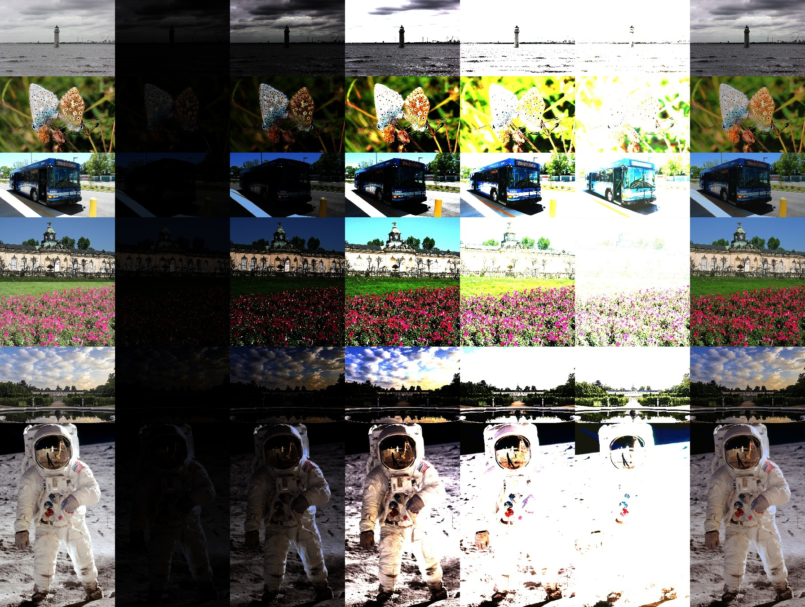

# ExpandNet

Create HDR images from LDR inputs:

<center>



| (left) LDR input | (middle) HDR prediction exposures | (right) Tone mapped HDR |
</center>

---

Weights and code for:

*ExpandNet: A Deep Convolutional Neural Network for High Dynamic Range Expansion from Low Dynamic Range Content*

Demetris Marnerides, Thomas Bashford-Rogers, Jonathan Hatchett and Kurt Debattista

Paper will be presented at Eurographics 2018.

---

## Prerequisites

Requires the PyTorch library along with OpenCV.

First follow the [instructions for installing PyTorch](http://pytorch.org/).

To install OpenCV use: 
```bash
conda install opencv -c menpo
```

---

## Usage

The script accepts an LDR image as input, and creates an HDR Image prediction (.hdr file).

```bash
python expand.py  ldr_input.jpg
```

Can also do batch processing

```bash
python expand.py  *.jpg
```

To put results in a separate directory:

```bash
python expand.py  *.jpg --out results/
```

Results can be resized and filenames can be tagged:
```bash
python expand.py test.jpg --resize True --height 960 --width 540 --tag my-tag
```

If a GPU is available and Pytorch detects it then the conversion will happen on the GPU. To force CPU usage (slower) set `--use_gpu False`.

The network operates on patches to limit memory usage when expanding high resolution images. The flag `--patch_size` adjusts the size.

The resulting HDR Image can be tone mapped using the TMOs provided by OpenCV, or using the exposure operator.

```bash
python expand.py  test.jpg --tone_map reinhard
```

---

## Testing on video

Use `--video True` (along with a tone mapper `--tone_map`) to test video conversion.

**WARNING** This is completely new and experimental. Very slow and memory consuming! Should only test short low-res clips. The model is not designed for videos thus flickering occurs which is reduced in the code by smoothing luminance percentile curves.

In the following example, on the left is the LDR video input and on the right is the (reinhard) tone mapped prediction.
<center>

</center>

Any tips to improve this are welcome!

---

Contact: dmarnerides@gmail.com